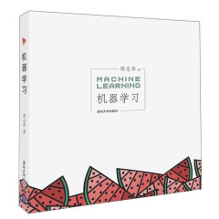

# gohappy

`人工智能` `数据挖掘` `机器学习` `深度学习` `大数据` `书籍推荐` `笔记练级`

---

此书单主要推荐干货类书籍。

笔者觉得书籍一般划分为总结类和干货类。怎么区分这两类书呢？
  
看名字基本能猜出个大概，第二就是看是否为动物园书，第三就是看封面了。封面做得那神乎其神的，基本都是总结类，干货较少
话不多说，我们开始吧

---

`联系方式`

作者|联系方式
---|---
陈大炮|feloxx@163.com

---

`收录的系列`

系列|书籍数量|笔记数量
---|---|---
基础数学系列|2本|0
算法系列|0本|0

---

## 基础数学系列

## 算法系列

## 机器学习系列

## 深度学习系列

## 大数据系列

## 人工智能系列

## 开发语言系列

