## gohappy

`人工智能` `数据挖掘` `机器学习` `深度学习` `大数据` `书籍推荐`

## 简介

　　此书单主要推荐干货类书籍。笔者觉得书籍一般分为两类。总结类和干货类。总结类的只能说是总结吧，对自己的提升还是较少，建议还是选择干货类书籍。

　　怎么区分这两类书呢？第一看名字，笔者是个程序员，入门的时候受过什么从零到精通、**天精通、一些听起来很浮夸却又很吸引人的标题。第二就是看是否为动物园书，第三就是看封面了。封面做得那神乎其神的，不就是忽悠你买书嘛，不然怎么挣钱。

　　扯远了，这是一个共享书单，主要分享人工智能，机器学习，大数据方面等书籍。同时也会分享对应书籍的笔记。初衷是笔者在一个人看书学习的时候苦于没人交流，很寂寥。所以搞了一个这样的书单，希望能遇到志同道合的朋友，共同学习，共同进步。推荐的书都是笔者正在读，或者想读的书，也欢迎大家来多多推荐。

　　想加入 书籍、笔记 共享的朋友可以与我联系，详情见联系方式。

> 书中自有颜如玉 你才是我的罂粟 去发现，去快乐
   --gohappy

## 联系方式

作者|联系方式
---|---
陈大炮|feloxx@163.com

## 收录的系列

系列|书籍数量|笔记数量
---|---|---
[基础数学系列](#math)    |7|0
[算法系列](#alg)        |5|0
[机器学习系列](#ml)      |7|0
[深度学习系列](#dl)      |1|0
[大数据系列](#bigdata)   |5|0
[人工智能系列](#ai)      |2|0
[开发语言系列](#lang)      |2|0

## 更新日志

时间|内容
---|---
2017-12-02|创建 gohappy

 

 

 

---

 

 

 

<h2 id="math">基础数学系列</h2>

`数学之美`

`统计学习方法`

`程序员的数学1`

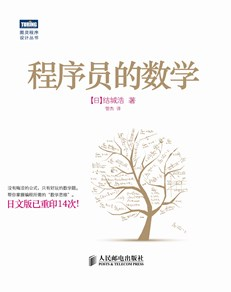

`程序员的数学2`

`程序员的数学2`

`统计思维：程序员数学之概率统计`

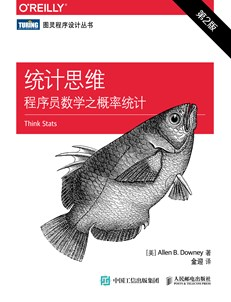

`具体数学：计算机科学基础`

## 算法、数据结构系列

`算法图解`

这本书算是算法入门的欢乐书籍了，很适合新手入门

`算法 第四版`

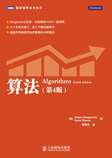

`算法导论 第三版`

`数据结构与算法分析：Java语言描述（原书第3版）`

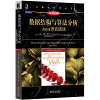

`数据算法：Hadoop/Spark大数据处理技巧`

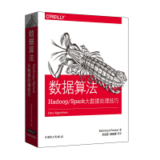

## 机器学习系列

`机器学习 西瓜书`

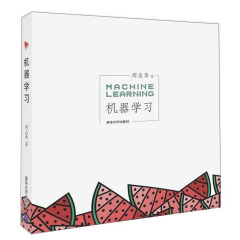

`图解机器学习`

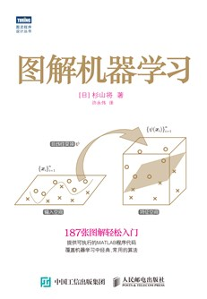

`机器学习实战`

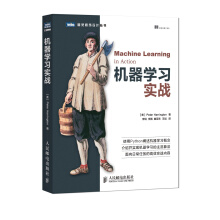

`数据挖掘：实用机器学习工具与技术（原书第3版）`

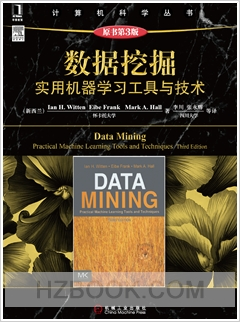

`Spark高级数据分析`

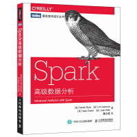

`Spark机器学习`

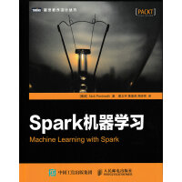

`Spark MLlib机器学习：算法、源码及实战详解`

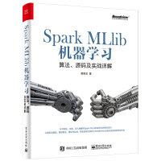

## 深度学习系列

`深度学习`

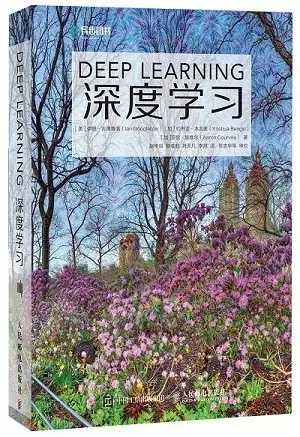

## 大数据系列

`hadoop 权威指南`

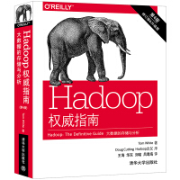

`Flume(构建高可用可扩展的海量日志采集系统)`

`ZooKeeper：分布式过程协同技术详解`

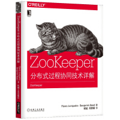

`从Paxos到Zookeeper分布式一致性原理与实践`

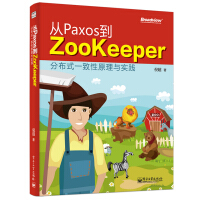

`Spark快速大数据分析`

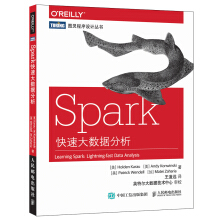

## 人工智能系列

`AI：人工智能的本质与未来`

`人工智能:一种现代的方法(第3版)`

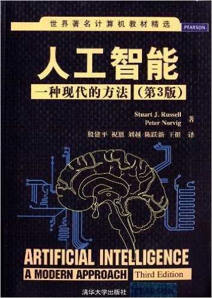

## 开发语言系列
